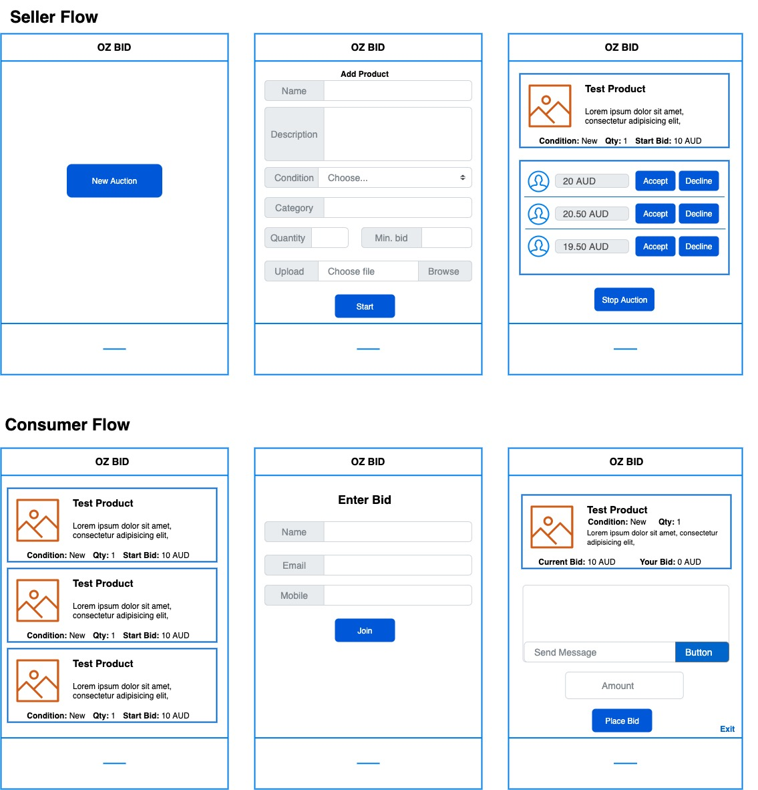
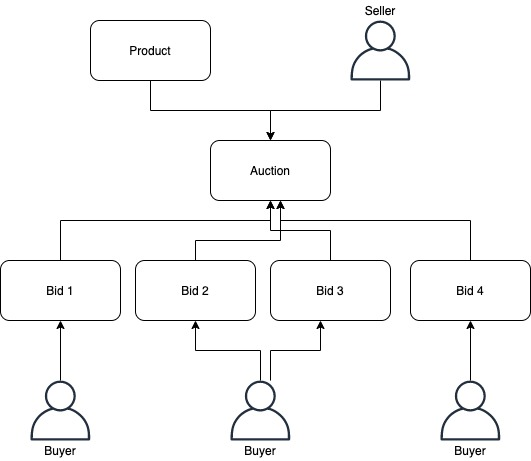

Bilue AWS Engineer Tech Challenge
==========================================

Welcome to the Bilue AWS Engineer Tech Challenge!  The purpose of this challenge is to help us assess your technical skills.  We know that you have limited time to devote to this task and may not be able to provide the complete solution as you would given more time, so we suggest you focus on the core requirements first, then any additional features if you have time left over.

## How this challenge will be assessed
At Bilue we believe the following skills are essential for successful software development:

 - Mastery of computer science and software engineering fundamentals
 - Understanding the broader context of software development
 - Strong communication skills

## OZ Bid
Oz Bid is an live auction app which want to bring transparency by creating a more realtime user experience. Anyone can come on the app and start a new Auction to sell their product. A product can have following attributes:

* Title
* Description
* Condition
* Category
* Quantity
* Min bid

Consumers can browse through list of active auction and can join to bid on the product. In order to bid on the product they need to provide below details:

1. Name
2. Email
3. Mobile

Along with that information seller can see two buttons: **Accept** and **Decline**

* Upon clicking on **Accept**, the bid must be updated to the **accepted** status in the database
* Upon clicking on **Decline**, the lead must be updated to the **declined** status in the database

Seller can accept the bid of their choice, upon which no further bid can be placed.  

A consumer can see see in real time what is the current bid going on. If they have any query, they can ask the seller from within the app

## The Task

Depending on the area of your focus (backend, frontend, full stack), please  complete the task below:

### Backend:

Build the backend api which can support:

1. The app to start a new Auction and add a new product to the auction
2. Provide the ability to accept or reject bid.
3. Ability to join the bid
4. Able to place new bid
5. Ablility to post messages to the seller

### Frontend:

1. List all active auctions
2. Create a new Auction
3. Add product to the Auction
4. Accept or reject bid
5. Join an auction
6. Place a bid

### Notes
* For the icons in the UI if you choose to build one, you can use something like font-awesome or SVG icons, whatever you choose.
* The UI flow is provided below:

- Below is the relationship diagram:

## Getting Started

We have provided a bit of boilerplate code that you can use to get started.  You are **not** required to use this boilerplate, so feel free to throw it all away and start fresh if you prefer.

The boilerplate code assumes you have Docker running on your machine.  If you do not, they offer easy to install binaries ([Mac](https://docs.docker.com/docker-for-mac/install/)) ([Windows](https://docs.docker.com/docker-for-windows/install/)).

From the root of the project, run `docker-compose up -d`
* You should now have the UI running at http://localhost:3000 and the server running at http://localhost:8080
* You should now have a MySQL database running at localhost:3306
    * The username is `root`
    * The password is `bilue`

If at any point you want to refresh the database, you can stop the Docker containers (`docker-compose down`) and start them again
    
## Submission
Please document your solution in the SOLUTION.md file.  This should explain why you've made the design choices that you have and clarify anything you feel isn't obvious.  Feel free to also include what else you would have done given more time.

**Please include instructions on how to run your app if it is not using the boilerplate provided.**

Once completed, please upload your solution to a public Github repo and share the link with **recruitment@bilue.com.au**